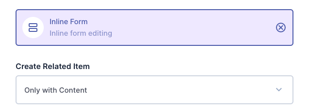

# Directus Inline Form Interface

An inline form interface for Directus that allows editing of a related M2O collection
item within its parent's form.

For more details as to why you would need this see these discussions in the Directus repository
[directus/directus#3474](https://github.com/directus/directus/discussions/3474) and
[directus/directus#18041](https://github.com/directus/directus/discussions/18041).

<picture>
  <source media="(prefers-color-scheme: dark)" srcset="./docs/screenshot-dark.png">
  
</picture>

## Installation

Add `directus-extension-inline-form-interface` to your project:


```shell
# Using pnpm
pnpm add directus-extension-inline-form-interface
# Using yarn
yarn add directus-extension-inline-form-interface
# Using npm
npm install directus-extension-inline-form-interface
```

## Usage

When creating a new M2O field you can select `Inline Form` in the `Relational` section.

Alternatively you can change the interface of an existing M2O field in the
`Interface` section.

## Options

#### `Create Related Item`

Decide when an item should be created in the related collection.

You can choose between:

- `Only with Content`, which will only create a new item if *some* content is filled in the inline form, and
- `Always`, which will always create a new item, even if no content is filled in the inline form
